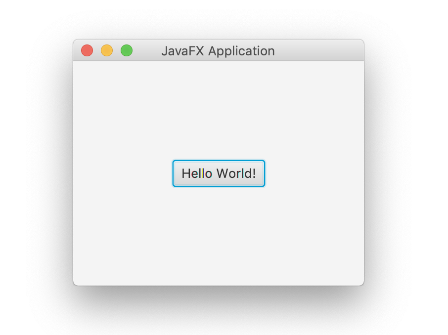
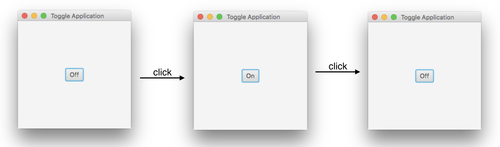

# FS20-L08-AB

## AB 8.1 (Button mit PresentationModel)
Programmieren Sie diese Anwendung:

Beachten Sie dabei folgendes:

1. Erweitern Sie das bekannte **Application Template** um ein Presentation Model.
2. Die neue Klasse `PresentationModel` enthält die Properties für den **Titel** der Applikation und die **Beschriftung des Buttons**.
3. Instanziieren Sie eine Instanz das PresentationModel in der Klasse `Starter`.
4. Übergabe des PresentationModels im Konstruktor der Klasse `ApplicationUI`
5. `ApplicationUI` bindet sich ausschliesslich an Properties des PresentationModels.

Nutzen Sie bis auf weiteres immer dieses Application Template.

**Frage:** Benutzen Sie `bind` oder `bindBidirectional` um die Properties zu binden? Warum treffen Sie diese Wahl?

## AB 8.2 (Toggle mit PresentationModel)
Erweitern Sie die Anwendung aus **AB01** um eine Toggle Funktionalität. Das bedeutet, dass ein Click auf den Button das Label des Buttons verändert. Das Bild zeigt, wie so ein Ablauf aussieht:

**Hinweise:** 
* Der EventHandler des Buttons ruft eine Methode `toggle()` des `PresentationModel` auf.
* Brauchen Sie eine Enum für die Zustände **On** und **Off**. 
